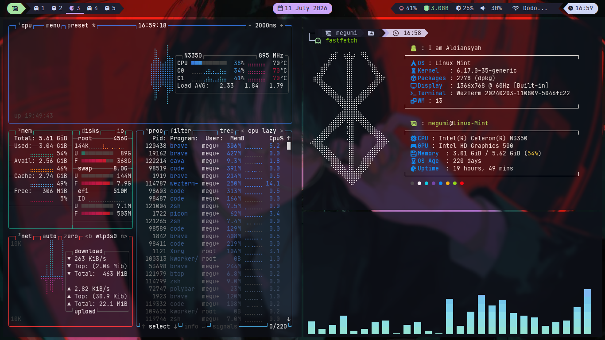
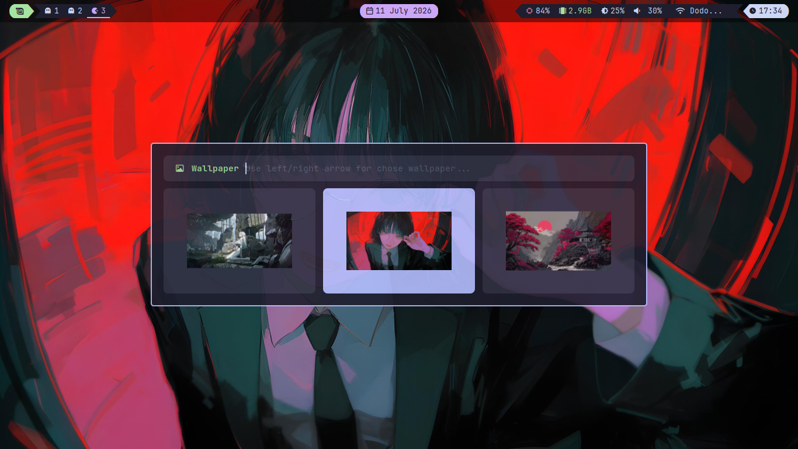

# Catppuccin Mocha i3wm Dotfiles

Selamat datang di repository **i3-dots** saya! Ini adalah konfigurasi lingkungan desktop (*desktop environment/rice*) minimalis berbasis **i3wm** dengan skema warna **Catppuccin Mocha**.

[](https://i3wm.org/)
[](https://github.com/catppuccin/catppuccin)
[](https://linuxmint.com/)

---

## Pratinjau (Screenshots)

<p align="center">
  
</p>


<p align="center">
  
</p>

---

## Spesifikasi Sistem & Komponen

| Komponen | Aplikasi / Aset yang Digunakan |
| :--- | :--- |
| **OS Base** | Linux Mint (XFCE Edition) |
| **Window Manager** | i3wm / i3-gaps |
| **Status Bar** | Polybar (Catppuccin Theme) |
| **Application Launcher** | Rofi (Modern Menu Layout) |
| **Notification Daemon** | Dunst |
| **Terminal Emulator** | WezTerm |
| **Shell Prompt** | Zsh + Starship Prompt |
| **Compositor (Blur/Transparansi)** | Picom |
| **Wallpaper Engine** | Nitrogen / Feh |
| **Main Font** | JetBrainsMono Nerd Font |

---

## Cara Instalasi (Installation)

> [!WARNING]
> Harap cadangkan (*backup*) konfigurasi asli Anda di folder `~/.config` sebelum menyalin dotfiles ini untuk menghindari hilangnya data setelan lama.

### 1. Clone Repository
```bash
git clone https://github.com/DanAldiansyah/i3-dots.git
cd i3-dots

```

### 2. Install Package Pendukung

```bash
sudo apt update
sudo apt install i3 polybar rofi picom dunst cava fastfetch nitrogen scrot zsh thunar

```
> [!NOTE]
> Pastikan Anda sudah menginstal **WezTerm** dan **Starship Prompt** secara terpisah sesuai dokumentasi resminya).

### 3. Salin File Konfigurasi

```bash
cp -r i3 polybar rofi picom dunst wezterm cava fastfetch starship ~/.config/

```

### 4. Berikan Izin Eksekusi Skrip (*Chmod*)

```bash
chmod +x ~/.config/polybar/scripts/*.sh
chmod +x ~/.config/rofi/scripts/*.sh
chmod +x ~/.config/dunst/scripts/*.sh

```

### 5. Salin Kumpulan Wallpaper

```bash
cp -r i3-wallpapers ~/Pictures/

```

### 6. Siapkan Direktori Tangkapan Layar

```bash
mkdir -p ~/Pictures/i3-screenshots/normal
mkdir -p ~/Pictures/i3-screenshots/area
mkdir -p ~/Pictures/i3-screenshots/delay

```

---

## Pintasan Keyboard Utama (Keybindings)

> [!NOTE]
> Tombol `Mod` pada setup ini dikonfigurasi menggunakan tombol **Super** (Tombol Windows).

### Manajemen Jendela & Workspace

| Kombinasi Tombol | Fungsi / Aksi | Aplikasi |
| --- | --- | --- |
| `Mod + (1-5)` | Berpindah Workspace | i3wm |
| `Mod + SHIFT + (1-5)` | Pindahkan jendela aktif ke Workspace lain | i3wm |
| `Mod + Arrow (Up/Right/Down/Left)` | Mengubah fokus jendela aktif | i3wm |
| `Ctrl + Arrow (Up/Right/Down/Left)` | Mengubah ukuran (*resize*) jendela | i3wm |
| `Mod + Shift + Space` | Mengaktifkan mode Floating Window | i3wm |
| `Mod + Q` | Menutup jendela yang sedang aktif | i3wm |
| `Mod + Shift + C` | Memuat ulang konfigurasi (*Reload*) | i3wm |
| `Mod + Shift + R` | Memuat ulang sesi i3wm (*Restart sesi*) | i3wm |

### Peluncur Aplikasi & Alat Pintas

| Kombinasi Tombol | Fungsi / Aksi | Aplikasi Pendukung |
| --- | --- | --- |
| `Mod + Enter` | Membuka Terminal Emulator | WezTerm |
| `Mod + R` | Membuka Menu Peluncur Aplikasi | Rofi Launcher |
| `Mod + W` | Membuka Menu Pemilih Wallpaper (Visual Grid) | Rofi Wallpaper Script |
| `Mod + E` | Membuka Menu Kontrol Daya (Powermenu) | Rofi Powermenu Script |
| `Mod + M` | Membuka Kontroler Musik | Rofi Music Script |
| `Mod + T` | Membuka File Manager | Thunar |
| `Mod + B` | Membuka Web Browser | Brave Origin |
| `Mod + N` | Membuka Pengatur Jaringan Internet | nmcli / nmtui |

### Tangkapan Layar (Screenshots)

| Kombinasi Tombol | Fungsi / Aksi | Aplikasi |
| --- | --- | --- |
| `PrintScreen` | Tangkapan layar penuh secara instan | Scrot |
| `Shift + PrintScreen` | Tangkapan layar penuh dengan jeda waktu 5 detik | Scrot |
| `Mod + PrintScreen` | Tangkapan layar pada area tertentu saja (Seleksi) | Scrot |

---