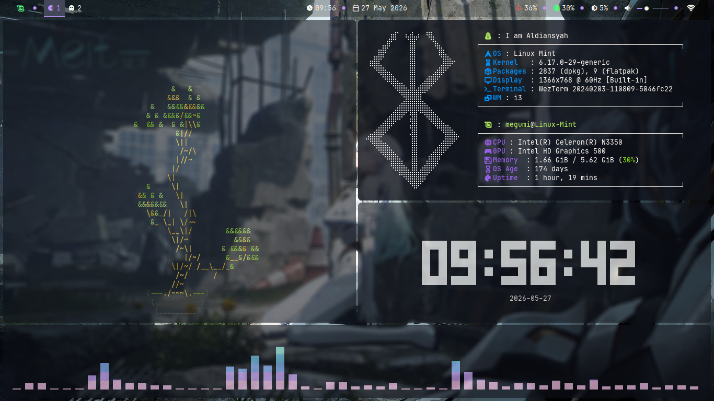
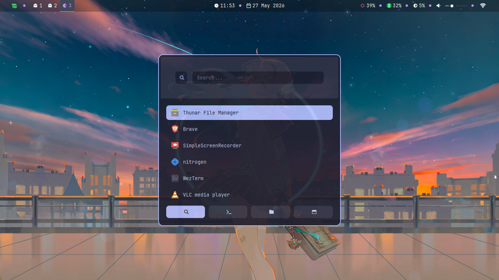
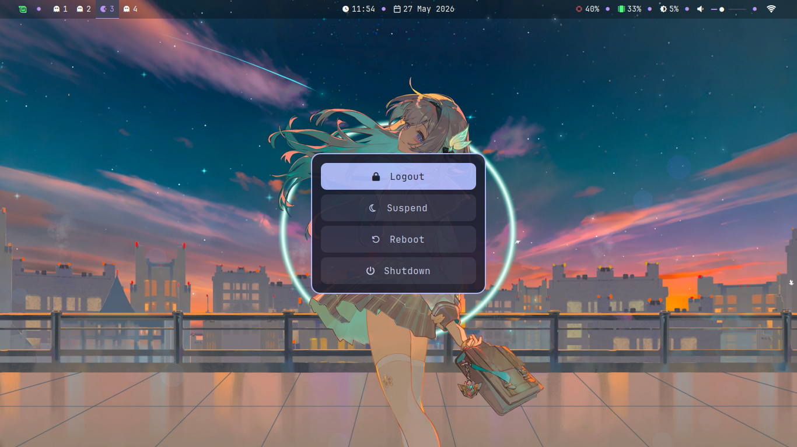
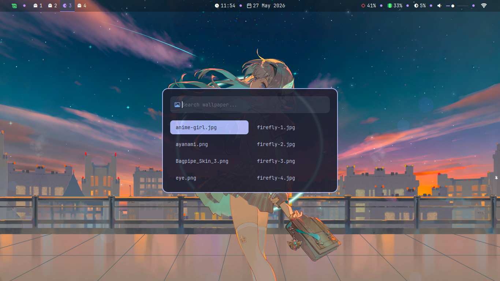

# Mochi-i3: Catppuccin Mocha i3wm Dotfiles

Selamat datang di repository **i3-dots** saya! Ini adalah konfigurasi lingkungan desktop (*desktop environment/rice*) minimalis berbasis **i3wm** dengan skema warna **Catppuccin Mocha**. 

---

## Pratinjau (Screenshots)


---



---

## Spesifikasi Sistem & Komponen
Aplikasi dan komponen utama yang digunakan dalam setup ini:
* **OS:** Linux Mint (XFCE Base)
* **WM:** i3wm
* **Status Bar:** Polybar
* **Application Launcher:** Rofi
* **Notification:** Dunst
* **Terminal Emulator:** WezTerm
* **Font:** JetBrainsMono Nerd Font 
* **Compositor:** Picom 
* **Wallpaper Manager:** Nitrogen

---

## Cara Instalasi (Installation)

> [!WARNING]
> Harap backup konfigurasi asli Anda di folder `~/.config` sebelum menyalin dotfiles ini.

### 1. Clone Repository

```bash
git clone https://github.com/DanAldiansyah/i3-dots.git
cd i3-dots

```
### 2. Install Package
```bash
sudo apt install i3 polybar rofi picom dunst nitrogen scrot 
```

### 3. Copy Dotfiles
```bash
cp -r i3 polybar rofi picom dunst wezterm cava fastfetch ~/.config/
```

### 4. Chmod
```bash
chmod +x ~/.config/polybar/scripts/*.sh
chmod +x ~/.config/rofi/scripts/*.sh
chmod +x ~/.config/dunst/scripts/*.sh
```

---

## Keybindings
> Berikut adalah daftar pintasan tombol (*keyboard shortcuts*) utama yang dikonfigurasi pada setup i3wm ini:

| Kombinasi Tombol | Fungsi / Aksi | Aplikasi Pendukung |
| :--- | :--- | :--- |
| `Mod + (1, 2, 3, 4, 5)` | ganti workspace | i3wm |
| `Mod + SHIFT + (1, 2, 3, 4, 5)` | pindahkan aktif windows ke workspace lain | i3wm |
| `Mod + arrow(up, right, down, left)` | ganti fokus window | i3wm |
| `Ctrl + arrow(up, right, down, left)` | resize window | i3wm |
| `Mod + Shift + Space` | Floating window | i3wm |
| `Mod + Enter` | Membuka Terminal | WezTerm |
| `Mod + Q` | Menutup Jendela yang Aktif | i3wm |
| `Mod + W` | Membuka Menu Pemilih Wallpaper | Rofi Wallpaper Script |
| `Mod + E` | Membuka Menu Kontrol Daya | Rofi Powermenu Script |
| `Mod + R` | Membuka Menu Aplikasi | Rofi Launcher |
| `PrintScreen` | Tangkapan Layar Seluruh Layar | Scrot |
| `Shift + PrintScreen` | Delay 5s Tangkapan Layar Seluruh Layar | Scrot |
| `Mod + PrintScreen` | Tangkapan Layar Seleksi Area | Scrot |
| `Mod + Shift + R` | Memuat Ulang Sesi (*Restart*) | i3wm |
| `Mod + Shift + C` | Memuat Ulang (*Reload*) | i3wm |

> [!NOTE] 
> Tombol `Mod` pada setup ini dikonfigurasi menggunakan tombol **Super** (tombol Windows).
